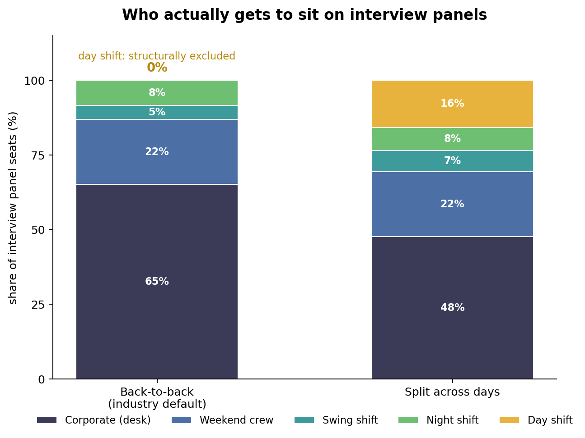

# Shift-aware interview scheduling

**Splitting an interview loop across days moves day-shift production workers from 0% to
~15% of interview panel seats — at no cost to how many loops get filled.**


[See the interviewer's view →](https://munnamihir.github.io/shift-aware-scheduling/panel_invite.html)
|  | Back-to-back | Split across days |
|---|---|---|
| loops filled | 74.6% | 73.7% |
| panel seats held by shift workers | ~38% | ~53% |
| day-shift seats | **0%** | **~15%** |
| max load on any one interviewer | 2 | 2 |

Figures vary by about a percentage point between runs — CP-SAT's parallel workers are
nondeterministic. Set `num_workers = 1` if you need them reproducible to the decimal.

## Why day shift is at zero

Interview scheduling tools assume the interviewer is a desk worker with an open calendar
between 9 and 5. In a manufacturing-heavy company, most people qualified to assess a
candidate are production, maintenance, or quality staff on rotating shifts. Their real
availability is a short window adjacent to a shift, at one physical site, on the days
that shift runs.

At a factory site, availability by hour looks like this:

```
09:00–13:00    643   corporate only
14:00         1,163  corporate + night shift (pre-shift)
15:00–16:00   1,989  corporate + night + swing (pre-shift)
17:00             0  shift changeover, nobody
18:00–19:00   1,118  day shift (post-shift)
```

The 18:00–19:00 block is 1,118 available interviewers. A four-round back-to-back onsite
needs four consecutive hours, and that window is two. So the largest single cohort at the
site is unreachable — not unwilling, not unqualified, just structurally excluded by the
shape of the loop.

Letting the four rounds land on different days fixes it, and costs nothing: fill rate
moves 74.6% → 73.7%, within run-to-run noise, while the interviewer bench widens
substantially.

The 17:00 dead hour is worth naming separately. It's shift changeover, and any
calendar-based tool will happily offer it.

## Running it

```bash
pip install ortools matplotlib
python bench.py     # back-to-back vs split, 100k interviewers / 2,000 loops (~90s)
python chart.py     # writes panel_seats.png
python sweep.py     # POOL_CAP sensitivity
```

Confirmed output is checked in as `results_baseline.txt`.

## The model

A constraint program, one shard per site, full week in a single model. Sharding per-day
doesn't work once a loop can straddle days.

**Decision variables**

- `w[loop, option]` — loop runs under this proposed schedule (at most one per loop)
- `a[loop, option, round, interviewer]` — this person takes this round

**Constraints**

- Every round of a chosen option gets exactly one interviewer
- No interviewer in two places at the same (day, slot)
- No interviewer twice on the same panel
- Debrief immediately after the last round, with all four panelists free
- Bar-raiser: at least one panelist at level 4+
- Cross-functional: at least one panelist outside the req's function
- Never assess above your own level
- Per-interviewer weekly cap

**Objective** — `maximize 100 * loops_filled - max_interviewer_load`. Filling loops
dominates; load fairness breaks ties, so nobody eats nine panels while a peer sits idle.

The debrief constraint is in deliberately. It works against the split-loop thesis — a
spread-out loop anchors its debrief to a later tail — and the result survives it.

## What keeps it tractable

Two things, and they matter more than the solver choice:

1. **Precomputed availability index** — `(site, day, slot) -> [interviewer]`, built once.
   Scanning the roster per round is O(loops × rounds × roster) and runs out of memory at
   100k people.
2. **Capped candidate shortlist** — several thousand people clear the hard filters for any
   given slot at a large site. Handing all of them to CP-SAT produces tens of millions of
   booleans and no better answer.

The shortlist has to stay *diverse across loops*, which is subtler than it sounds. An
earlier version ranked the whole pool by remaining capacity; since load is uniformly zero
at the start of a shard, every loop shortlisted the same high-capacity people, they
collided on shared slots, and fill rate fell from 75% to 16%. The tell was
`max interviewer load: 1` — when the solver can't reuse anyone, the shortlists are
identical. Diversity first, load-balancing second.

At 100k interviewers and 2,000 loops: 6 shards, ~45s wall, small shards prove OPTIMAL in
under 6s.

## What's unfinished

1. **`POOL_CAP` sensitivity is unresolved.** Fill rate appears to *fall* as the shortlist
   grows, which is impossible for a genuine superset — a larger pool can't make the
   optimum worse. Either the shortlists aren't nested across caps or the larger models
   are hitting the time limit. `sweep.py` prints solver status to help tell which.
2. **The effect is density-sensitive.** It weakens below roughly 10k interviewers per
   site, where the shortlist starves the day-shift pool. Worth characterising properly.
3. **No timezone handling.** Slots are site-local; a cross-site panelist needs offset
   conversion.
4. **No competency matching** beyond function and level.
5. **No candidate- or interviewer-side UX.** The point of a deskless-first tool is that
   the interviewer confirms from a phone or a shop-floor kiosk, not Outlook.

## Caveats

Synthetic data throughout — shift patterns, site mix, and interviewer levels are modeled,
not observed. The *mechanism* (a two-hour window can't host a four-hour loop) holds
regardless of the numbers. The *magnitude* would need real availability data to confirm.
